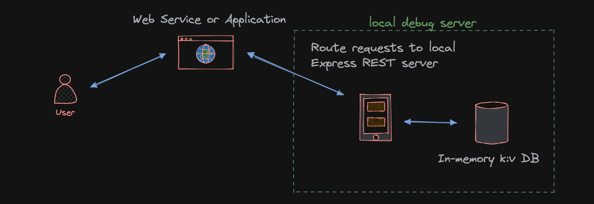

# NodeJS local server debug tool [In Progress]

# Table of Contents

1. [Design](#design)
2. [Quick Start](#quick-start)
   1. [NPM](#npm-quick-start)
   2. [Yarn](#yarn-quick-start)
3. [Instructions](#instructions)
4. [Sample Use](#sample-use)

## Design

Intended as a debug tool for REST and eventually GraphQL / gRPC / tRPC protocol. As needed, change the output of REST services by routing to this local server and setting the response. This allows end-to-end and integrated testing with frontend changes without being blocked by pending dependency API updates. While mocking and intercepting are options, they become increasingly more time consuming in many-layered frontend apps/frameworks that have rendering subscriptions, hooks, and other dynamic functionality. Instead, You can just spin up the local REST server in minutes. The server implementation is kept flat and free from unnecessary abstraction to make modifications easy. Just open {{root}}/src/server/server.mjs and update Express REST endpoints as needed. Default CRUD operations are given. Postman collections are also added so feel free to use those to verify setup.

## Quick Start

### NPM Quick Start

1. CD into project root.
2. Ensure you have the latest Node version v19 or higher.
   You can use `nvm` to get the latest with `nvm install node`. Or switch to v19 or higher with, `nvm use 19`.
3. Run `npm install` command to install required packages.
4. Run `npm run start` to start the local Express server.
5. Open your browser, Postman, or make a cURL GET request to the server.
6. Modify the server (`./src/server/server.mjs`) and mock the req/res to match your live server.
7. (Optional) You can use `npm run watch` to automatically restart the server after making saved changes.

### Yarn Quick Start

1. CD into project root.
2. Ensure you have the latest Node version v19 or higher.
   You can use `nvm` to get the latest with `nvm install node`. Or switch to v19 or higher with, `nvm use 19`.
3. Run `yarn` command to install required packages.
4. Run `yarn run start` to start the local Express server.
5. Open your browser, Postman, or make a cURL GET request to the server.
6. Modify the server (`./src/server/server.mjs`) and mock the req/res to match your live server.
7. (Optional) You can use `yarn run watch` to automatically restart the server after making saved changes.

## Instructions

After following quick start, consider what endpoints you'd like to build with. For example, suppose an API is needed to finish a frontend task, and in order to render some higher-order-component, a user fetch object is required. You can go to the DB and set the needed objects (or POST them in from Postman). Simply start the server and reroute your requests to the local REST server. Detailed logs are available in your console, and each session will stream logs to an `out.log` file in the repo root.

## Sample Use

## Next steps

Adding functionality for this repo to act as a stand-in server for other communication protocols: GraphQL, tRPC, gRPC. And consider ways to improve the ease of use and utility for REST.
